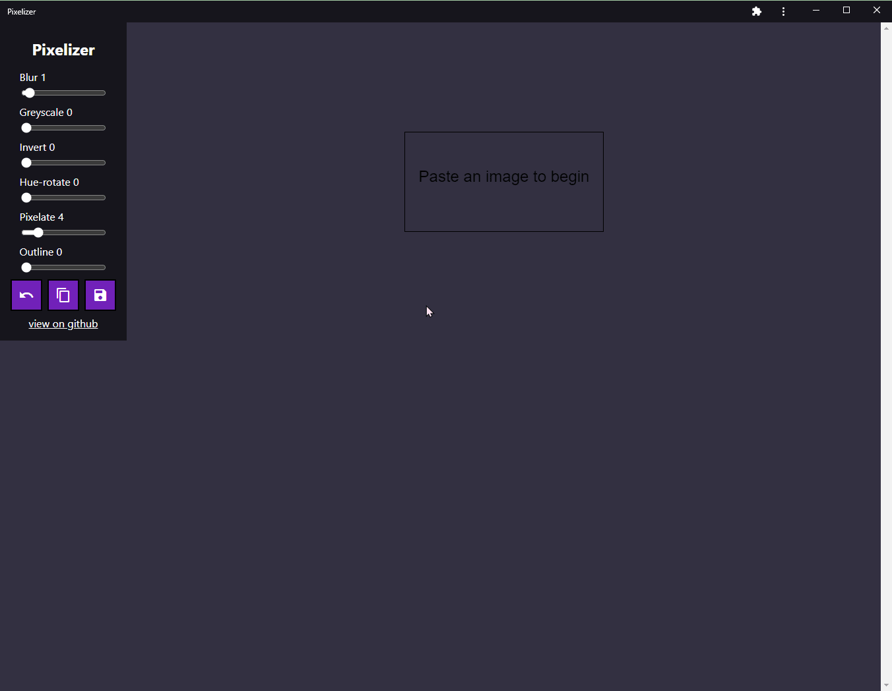

# Quick Image Editor

A quick image editor for censoring regions of images. Simply paste your image into the window and adjust the filters to your liking.

Image editing happens entirely in the browser and images are never transmitted to any servers.

